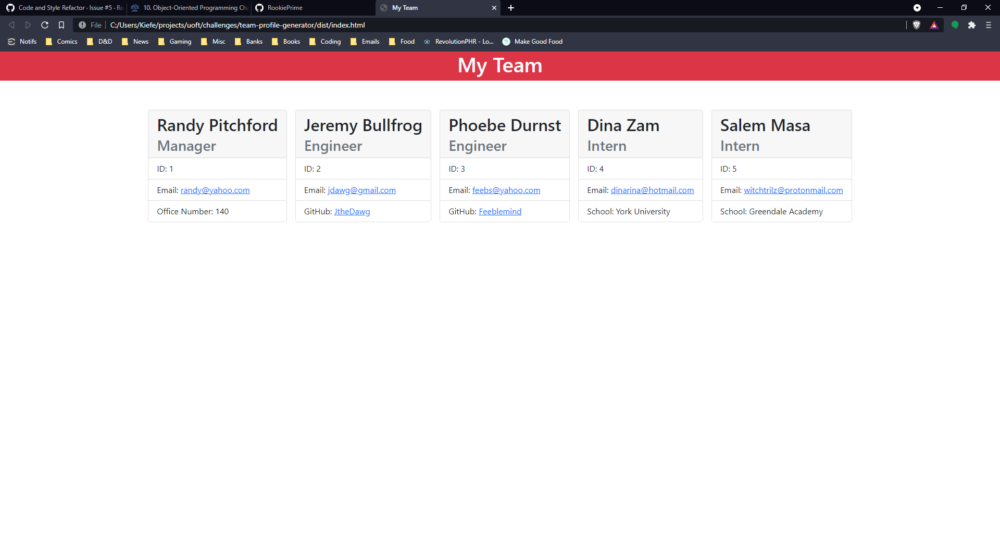

# TEAM PROFILE GENERATOR 
## Description
This application takes a set of employees provided by the user and generates an HTML page with CSS styling.

## Table of Contents
- [Installation](#Installation)
- [Usage](#Usage)

- [Questions](#Questions)
- [Code-of-Conduct](#Code-of-Conduct)
- [License](#License)

## Installation
To install this application, follow the below instructions:
    - First, you need to clone this project from its GitHub repository.
    - Second, you need to go into your terminal and navigate to the directory of your clone of this repo. The directory should end with /professional-readme-generator, if it's the right one.
    - Third, once at the correct directory, you must use the command `npm i` to install all the dependencies of the application.
    - At this point, you should be good to go!

## Usage
Input is via the command line. There is no way to go back and revise the text once it has been entered, except by editing the finished HTML file. If you accidentally choose to enter a new employee but don't have one to enter, you can choose 'Neither' to finish input and generate the HTML file.

## Questions
If you need to reach me, my GitHub username (and a link to my profile page) is [RookiePrime](https://github.com/RookiePrime) and my email address is [kiefer_8@hotmail.com](mailto:kiefer_8@hotmail.com).

## Code-of-Conduct
### Contributor Covenant
We as members, contributors, and leaders pledge to make participation in our
community a harassment-free experience for everyone, regardless of age, body
size, visible or invisible disability, ethnicity, sex characteristics, gender
identity and expression, level of experience, education, socio-economic status,
nationality, personal appearance, race, caste, color, religion, or sexual identity
and orientation.

We pledge to act and interact in ways that contribute to an open, welcoming,
diverse, inclusive, and healthy community.
[Click here to read the full code of conduct](https://www.contributor-covenant.org/version/2/0/code_of_conduct/)

## License
This software is offered under the MIT License. For more information on conditions of use, [follow this link.](https://opensource.org/licenses/MIT).